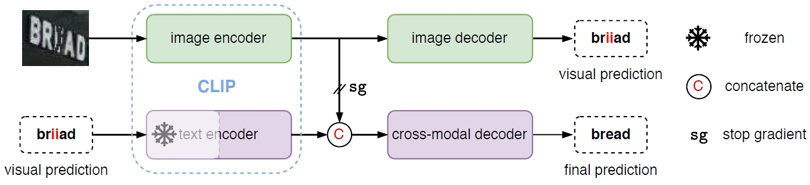

# CLIP4STR

This is a dedicated re-implementation of [CLIP4STR: A Simple Baseline for Scene Text Recognition with Pre-trained Vision-Language Model
](https://arxiv.org/abs/2305.14014).


##  Table of Contents

<!--ts-->
* [Introduction](#Introduction)
* [Installation](#Installation)
* [Results](#Results)
* [Training](#Training) 
* [Inference](#Inference)
* [Citations](#Citations)
* [Acknowledgements](#Acknowledgements)
<!--te-->


## Introduction

<div align="justify">

This is a **third-party implementation** of the paper 
<a href="https://arxiv.org/abs/2305.14014">
CLIP4STR: A Simple Baseline for Scene Text Recognition with Pre-trained Vision-Language Model.
</a>
<div align=center>
  </pr>
  
  The framework of CLIP4STR. It has a visual branch and a cross-modal branch. The cross-modal branch
refines the prediction of the visual branch for the final output. The text encoder is partially frozen.
</div>

CLIP4STR aims to build a scene text recognizer with the pre-trained vision-language model. In this re-implementation,
we try to reproduce the performance of the original paper and evaluate the effectiveness of pre-trained VL models in the STR area.


## Installation

### Prepare data

First of all, you need to download the STR dataset. 

- We recommend you follow the instructions of [PARSeq](https://github.com/baudm/parseq) at its [parseq/Datasets.md](https://github.com/baudm/parseq/blob/main/Datasets.md) . 
The gdrive links are [gdrive-link1](https://drive.google.com/drive/folders/1NYuoi7dfJVgo-zUJogh8UQZgIMpLviOE) and [gdrive-link2](https://drive.google.com/drive/folders/1D9z_YJVa6f-O0juni-yG5jcwnhvYw-qC) from PARSeq.

- For convenient, you can also download the STR dataset with real training images at [BaiduYunPan str_dataset](https://pan.baidu.com/s/1DY8zYYQ9EHi3_P9pY46DdQ?pwd=hpvw).

- weights of CLIP pre-trained models:
    - [CLIP-ViT-B/32](https://openaipublic.azureedge.net/clip/models/40d365715913c9da98579312b702a82c18be219cc2a73407c4526f58eba950af/ViT-B-32.pt)
    - [CLIP-ViT-B/16](https://openaipublic.azureedge.net/clip/models/5806e77cd80f8b59890b7e101eabd078d9fb84e6937f9e85e4ecb61988df416f/ViT-B-16.pt)
    - [CLIP-ViT-L/14](https://openaipublic.azureedge.net/clip/models/b8cca3fd41ae0c99ba7e8951adf17d267cdb84cd88be6f7c2e0eca1737a03836/ViT-L-14.pt)


Generally, directories are organized as follows:
```
${ABSOLUTE_ROOT}
├── dataset
│   │
│   └── str_dataset           
│       ├── train
│       │   ├── real
│       │   └── synth
│       ├── val     
│       └── test
│
├── code              
│   │
│   └── clip4str
│
├── output (save the output of the program)
│
│
├── pretrained
│   └── clip (download the CLIP pre-trained weights and put them here)
│       └── ViT-B-16.pt
│
...
```

### Dependency

Requires `Python >= 3.8` and `PyTorch >= 1.12`.
The following commands are tested on a Linux machine with CUDA Driver Version `525.105.17` and CUDA Version `11.3`.
```
conda create --name clip4str python==3.8
conda install pytorch==1.12.0 torchvision==0.13.0 torchaudio==0.12.0 -c pytorch
pip install -r requirements.txt 
```


## Results

`CLIP4STR-B` means using the `CLIP-ViT-B/16` as the backbone, and `CLIP4STR-L` means using the `CLIP-ViT-L/14` as the backbone.


| Method     | Train data | IIIT5K | SVT   | IC13  | IC15  | IC15  | SVTP  | CUTE  | HOST  | WOST  |
|------------|------------|--------|-------|-------|-------|-------|-------|-------|-------|-------|
|            |            | 3,000  | 647   | 1,015 | 1,811 | 2,077 | 645   | 288   | 2,416 | 2,416 | 
| CLIP4STR-B  | MJ+ST      | 97.70  | 95.36 | 96.06 | 87.47 | 84.02 | 91.47 | 94.44 | 80.01 | 86.75 | 
| CLIP4STR-L  | MJ+ST      | 97.57  | 95.36 | 96.75 | 88.02 | 84.40 | 91.78 | 94.44 | 81.08 | 87.38 |
| CLIP4STR-B  | Real(3.3M) | 99.20  | 98.30 | 98.23 | 91.44 | 90.61 | 96.90 | 99.65 | 77.36 | 87.87 | 
| CLIP4STR-L  | Real(3.3M) | 99.43  | 98.15 | 98.52 | 91.66 | 91.14 | 97.36 | 98.96 | 79.22 | 89.07 | 


| Method     | Train data | COCO  | ArT    | Uber   | | Checkpoint |
|------------|------------|-------|--------|--------|-|--------|
|            |            | 9,825 | 35,149 | 80,551 | | |
|CLIP4STR-B  | MJ+ST      | 66.69 | 72.82  | 43.52  | | [a5e3386222](https://github.com/VamosC/CLIP4STR/releases/download/1.0.0/clip4str_base16x16_synth_a5e3386222.ckpt) |
|CLIP4STR-L  | MJ+ST      | 67.45 | 73.48  | 44.59  | | [3544c362f0](https://zenodo.org/record/8369439) |
|CLIP4STR-B  | Real(3.3M) | 80.80 | 85.74  | 86.70  | | [d70bde1f2d](https://github.com/VamosC/CLIP4STR/releases/download/1.0.0/clip4str_base16x16_d70bde1f2d.ckpt) |
|CLIP4STR-L  | Real(3.3M) | 81.97 | 85.83  | 87.36  | | [f125500adc](https://zenodo.org/record/8369439) |


## Training

- Before training, you should set the path properly. Find the `/PUT/YOUR/PATH/HERE` in `configs`, `scripts`, `strhub/vl_str`, and `strhub/str_adapter`. For example, the `/PUT/YOUR/PATH/HERE` in the `configs/main.yaml`. Then replace it with your own path. A global searching and replacement is recommended.


For CLIP4STR with `CLIP-ViT-B`, refer to
```
bash scripts/vl4str_base.sh
```
8 NVIDIA GPUs with more than 24GB memory (per GPU) are required.
For users with limited GPUs,
you can change `trainer.gpus=A`, `trainer.accumulate_grad_batches=B`, and `model.batch_size=C` under the condition `A * B * C = 1024` in the bash scripts.
Do not modify the code, the `PyTorch Lightning` will handle the left.


For CLIP4STR with `CLIP-ViT-L`, refer to
```
bash scripts/vl4str_large.sh
```

We also provide the training script of `CLIP4STR + Adapter` described in the original paper,
```
bash scripts/str_adapter.sh
```


## Inference


```
bash test.sh {gpu_id} {subpath_of_ckpt}
```
For example,
```
bash scripts/test.sh 0 clip4str_base16x16_d70bde1f2d.ckpt
```

If you want to read characters from an image, try:
```
bash test.sh {gpu_id} {subpath_of_ckpt} {image_folder_path}
```
For example,
```
bash scripts/read.sh 0 clip4str_base16x16_d70bde1f2d.ckpt misc/test_images

Output:
image_1576.jpeg: Chicken
```


## Citations

A BibTeX of CLIP4STR from the DBLP is:
```
@article{DBLP:journals/corr/abs-2305-14014,
  author       = {Shuai Zhao and
                  Xiaohan Wang and
                  Linchao Zhu and
                  Yi Yang},
  title        = {{CLIP4STR:} {A} Simple Baseline for Scene Text Recognition with Pre-trained
                  Vision-Language Model},
  journal      = {CoRR},
  volume       = {abs/2305.14014},
  year         = {2023},
  url          = {https://doi.org/10.48550/arXiv.2305.14014},
  doi          = {10.48550/arXiv.2305.14014},
  eprinttype    = {arXiv},
  eprint       = {2305.14014},
  timestamp    = {Mon, 05 Jun 2023 15:42:15 +0200},
  biburl       = {https://dblp.org/rec/journals/corr/abs-2305-14014.bib},
  bibsource    = {dblp computer science bibliography, https://dblp.org}
}
```


## Acknowledgements

This repo is built upon these previous works.

<!--ts-->
* [baudm/parseq](https://github.com/baudm/parseq)
* [openai/CLIP](https://github.com/openai/CLIP)
* [mlfoundations/open_clip](https://github.com/mlfoundations/open_clip)
* [huggingface/transformers](https://github.com/huggingface/transformers)
* [mzhaoshuai/CenterCLIP](https://github.com/mzhaoshuai/CenterCLIP)
* [VamosC/CoLearning-meet-StitchUp](https://github.com/VamosC/CoLearning-meet-StitchUp)
<!--te-->
